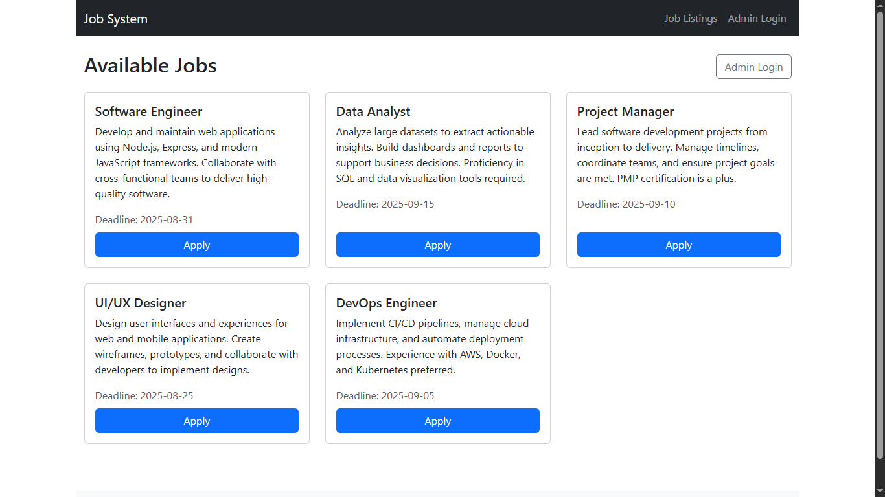
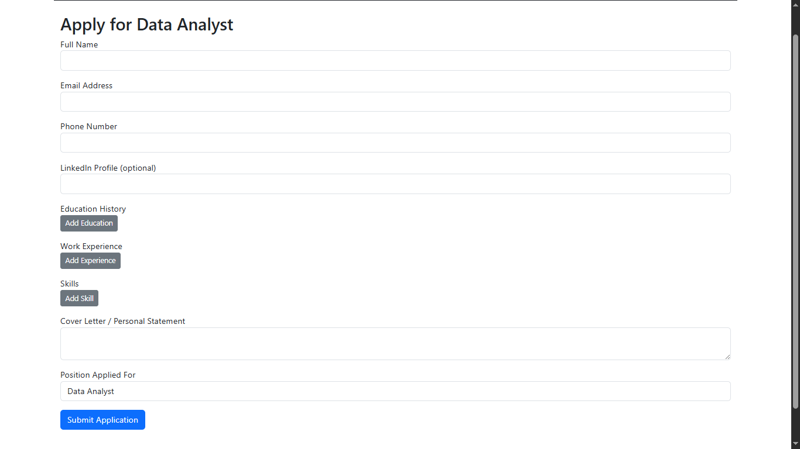
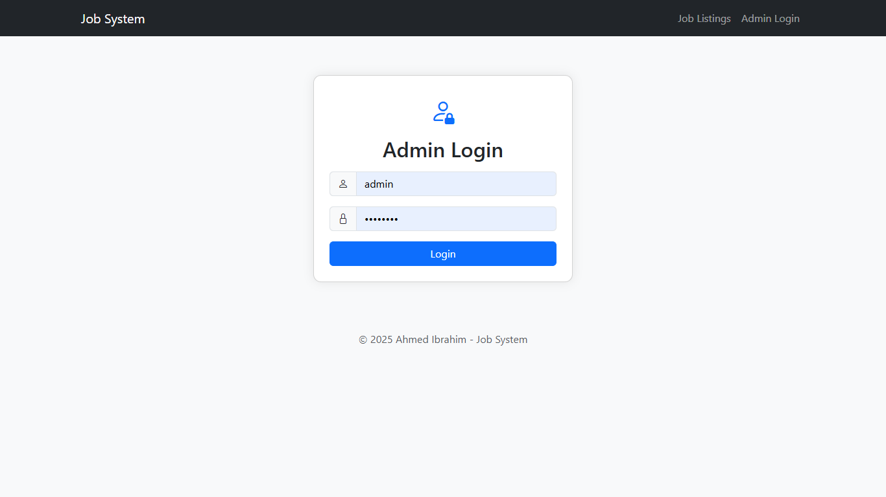
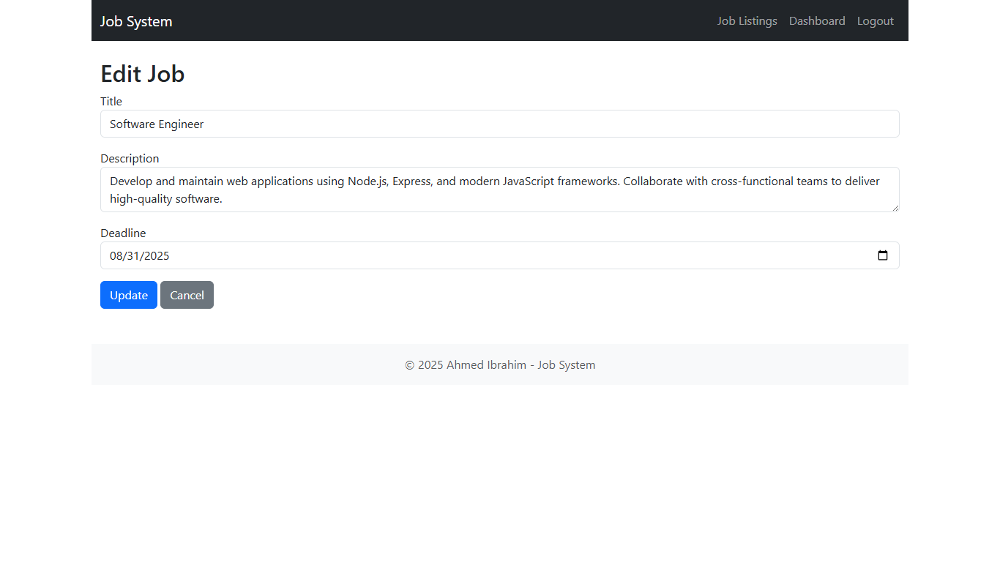
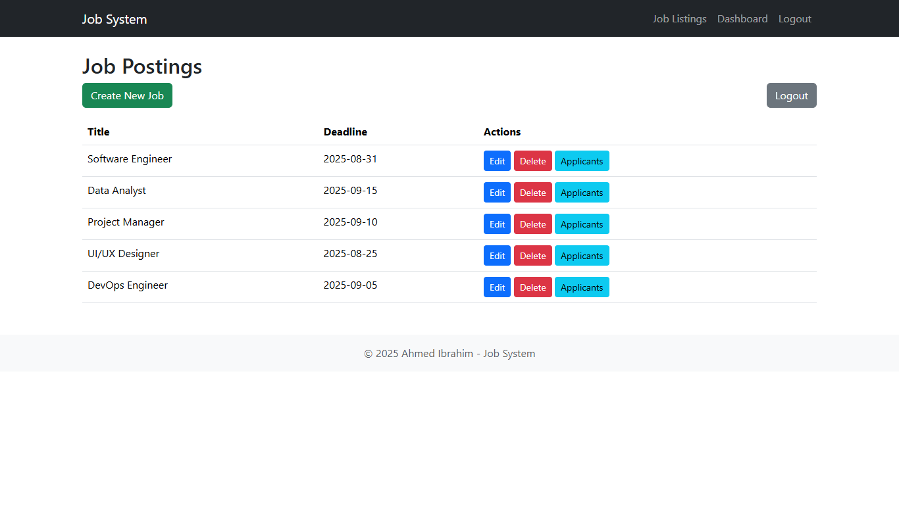

# Job System

A simple job application system with public job listings and an admin dashboard.

## Features
- Public job listings and application form
- Admin authentication and dashboard
- Job and applicant management
- SQLite database

## Screenshots

### Job Listing


### Application Form


### Admin Login


### Add/Edit Job


### CRUD Operations


## Setup
1. Clone the repository
2. Run `npm install`
3. Create a `.env` file with:
   ```
   ADMIN_USER=admin
   ADMIN_PASS=admin123
   DB_PATH=./database.sqlite
   ```
4. Seed the database:
   - `node seedJobs.js`
      
5. Start the server:
   - `node app.js`

## Usage
- Public users can view jobs and apply
- Admin can log in at `/admin/login` to manage jobs and view applicants

---
Built with Node.js, Express, EJS, Bootstrap, and SQLite. 